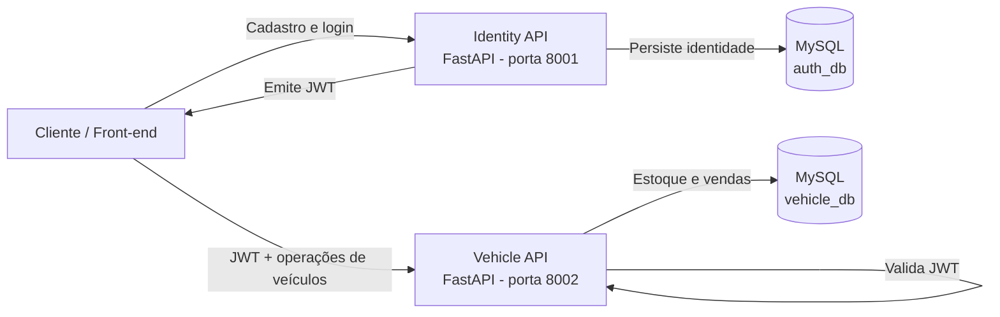
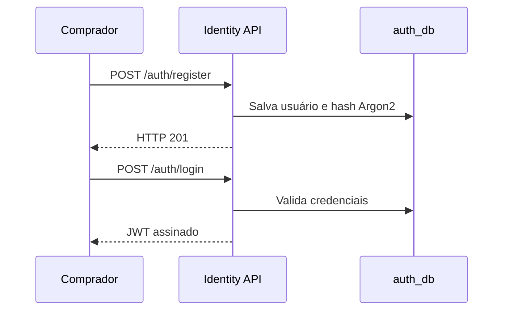
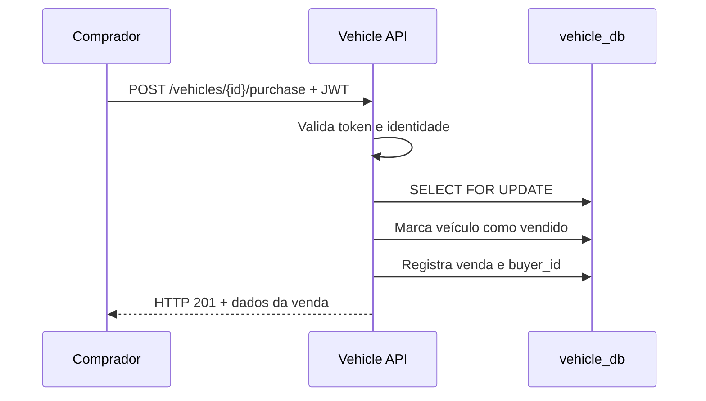
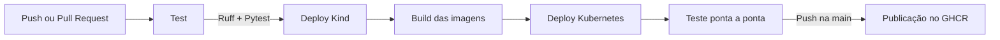

# SOAT Vehicle Platform

MVP back-end de uma plataforma de revenda de veículos desenvolvido para o **Tech Challenge SOAT - Fase 3**.

A solução permite cadastrar compradores e veículos, editar os dados do estoque, consultar veículos disponíveis, realizar compras pela internet e consultar o histórico de vendidos. O projeto foi construído com foco em arquitetura de software, segurança, separação de responsabilidades, persistência relacional, containerização e automação de entrega.

## 🎯 Objetivo da solução

O objetivo é disponibilizar as APIs necessárias para que uma futura aplicação front-end possa operar uma revenda de veículos pela internet.

O fluxo principal contempla:

1. cadastro prévio do comprador;
2. autenticação e emissão de token JWT;
3. cadastro de veículos pelo administrador;
4. edição de veículos disponíveis;
5. listagem do estoque por preço crescente;
6. compra autenticada;
7. efetivação e registro da venda;
8. listagem dos vendidos por preço crescente.

## ✅ Requisitos atendidos

| Requisito | Implementação |
|---|---|
| Cadastrar veículo | `POST /vehicles`, restrito a administrador |
| Editar veículo | `PATCH /vehicles/{vehicle_id}`, restrito a administrador |
| Cadastrar comprador antes da compra | `POST /auth/register` |
| Autenticar comprador | `POST /auth/login`, com emissão de JWT |
| Comprar veículo pela internet | `POST /vehicles/{vehicle_id}/purchase` |
| Listar veículos à venda por preço | `GET /vehicles/available` |
| Listar veículos vendidos por preço | `GET /vehicles/sold`, restrito a administrador |
| Separar dados pessoais e transacionais | Serviço e banco exclusivos para identidade |
| Utilizar Pull Requests e CI/CD | GitHub Actions em pushes e Pull Requests |
| Realizar deploy automatizado | Cluster Kind criado e validado pela pipeline |

## 🏗️ Arquitetura da solução



A aplicação possui dois serviços independentes:

| Serviço | Porta local | Responsabilidade |
|---|---:|---|
| Identity API | `8001` | Cadastro, autenticação, hash de senha, papéis e emissão de JWT |
| Vehicle API | `8002` | Estoque, edição, catálogo, compra e histórico de vendas |
| Auth MySQL | Interna | Dados pessoais e credenciais no schema `auth_db` |
| Vehicle MySQL | Interna | Veículos e vendas no schema `vehicle_db` |

### Separação dos dados

O **Identity Service** é o único componente que conhece nome, e-mail e senha do comprador. O banco transacional de veículos registra apenas o campo `buyer_id`, recebido por meio do token.

Essa separação evita que os dados pessoais dos clientes sejam armazenados junto ao estoque e às vendas, atendendo à principal restrição arquitetural do desafio.

## 🔁 Fluxos principais

### Cadastro e autenticação



### Compra de um veículo



A compra utiliza bloqueio transacional com `SELECT FOR UPDATE` e uma restrição única por veículo. Essas duas proteções impedem que o mesmo veículo seja vendido duas vezes em requisições concorrentes.

## 🗄️ Persistência de dados

A solução utiliza **MySQL 8.4** com bancos independentes por domínio.

| Serviço | Banco/schema | Dados armazenados |
|---|---|---|
| Identity API | `auth_db` | usuário, nome, e-mail, hash da senha, papel e data de criação |
| Vehicle API | `vehicle_db` | veículos, situação do estoque, comprador opaco, preço e data da venda |

### Modelo de identidade

`users`:

- `id` em UUID;
- `name`;
- `email` único;
- `password_hash`;
- `role`: `buyer` ou `admin`;
- `created_at`.

### Modelo transacional

`vehicles`:

- marca, modelo, ano, cor e preço;
- status `available` ou `sold`;
- datas de criação e alteração.

`sales`:

- veículo vendido, com restrição única;
- `buyer_id` sem dados pessoais;
- preço congelado no momento da venda;
- data da venda.

As migrations são executadas com **Alembic** antes da inicialização de cada API. O script de startup possui retentativas para aguardar o MySQL ficar completamente disponível.

## 🔐 Segurança e regras de negócio

- Senhas armazenadas com hash **Argon2**;
- autenticação stateless com JWT;
- expiração configurável do token;
- autorização baseada nos papéis `buyer` e `admin`;
- e-mail único e normalizado em letras minúsculas;
- schemas Pydantic para validação das entradas;
- veículo vendido não pode ser alterado;
- veículo vendido não pode ser comprado novamente;
- preço deve ser positivo;
- ano do veículo possui limites de validação;
- listagens possuem paginação com `limit` e `offset`;
- segredos fornecidos por variáveis de ambiente;
- `.env` excluído do versionamento.

> As credenciais de demonstração são apenas para execução local. Em produção, devem ser utilizados segredos fortes, um gerenciador de secrets e, preferencialmente, JWT assimétrico com RS256/JWKS.

## 🚀 Tecnologias utilizadas

- Python 3.12;
- FastAPI;
- SQLAlchemy 2 com suporte assíncrono;
- MySQL 8.4;
- Alembic;
- Pydantic;
- JWT;
- Argon2;
- Docker;
- Docker Compose;
- Kubernetes;
- Kind;
- Terraform;
- Pytest;
- Ruff;
- GitHub Actions;
- GitHub Container Registry.

## 📋 Pré-requisitos

Para execução local:

- Docker Desktop;
- Docker Compose v2;
- Git.

O Python local é opcional, pois as APIs e os testes de integração executam em containers.

## 🛠️ Execução local

### 1. Clonar o repositório

```bash
git clone https://github.com/Hackaton-Fiap-Matheus-Pereira/soat-vehicle-platform
cd soat-vehicle-platform
```

### 2. Configurar as variáveis de ambiente

Linux ou macOS:

```bash
cp .env.example .env
```

Windows PowerShell:

```powershell
Copy-Item .env.example .env
```

O arquivo `.env.example` documenta todas as variáveis. Antes de utilizar o projeto fora do ambiente local, altere o `JWT_SECRET` e as credenciais administrativas.

### 3. Subir a aplicação

```bash
docker compose up --build -d
```

### 4. Verificar os containers

```bash
docker compose ps
```

O resultado esperado contém:

- `auth-db` saudável;
- `vehicle-db` saudável;
- `auth-service` em execução;
- `vehicle-service` em execução.

### 5. Verificar a saúde das APIs

Windows PowerShell:

```powershell
Invoke-RestMethod http://localhost:8001/health
Invoke-RestMethod http://localhost:8002/health
```

Linux ou macOS:

```bash
curl http://localhost:8001/health
curl http://localhost:8002/health
```

Resposta esperada:

```json
{"status":"ok"}
```

## 🌐 URLs da aplicação

| Serviço | URL |
|---|---|
| Identity API - Swagger | http://localhost:8001/docs |
| Identity API - OpenAPI | http://localhost:8001/openapi.json |
| Vehicle API - Swagger | http://localhost:8002/docs |
| Vehicle API - OpenAPI | http://localhost:8002/openapi.json |
| Health Identity | http://localhost:8001/health |
| Health Vehicle | http://localhost:8002/health |

## 📚 Endpoints

### Identity API

| Método | Endpoint | Autorização | Descrição |
|---|---|---|---|
| `POST` | `/auth/register` | Pública | Cadastra previamente um comprador |
| `POST` | `/auth/login` | Pública | Autentica e retorna um token JWT |
| `GET` | `/health` | Pública | Verifica a saúde do serviço |

### Vehicle API

| Método | Endpoint | Autorização | Descrição |
|---|---|---|---|
| `POST` | `/vehicles` | Administrador | Cadastra um veículo para venda |
| `PATCH` | `/vehicles/{vehicle_id}` | Administrador | Edita um veículo disponível |
| `GET` | `/vehicles/available` | Pública | Lista disponíveis por preço crescente |
| `POST` | `/vehicles/{vehicle_id}/purchase` | JWT | Realiza a compra de um veículo |
| `GET` | `/vehicles/sold` | Administrador | Lista vendidos por preço crescente |
| `GET` | `/health` | Pública | Verifica a saúde do serviço |

## 🧪 Demonstração ponta a ponta

Com os containers em execução, rode:

```powershell
./scripts/demo.ps1
```

O script executa automaticamente:

1. cadastro do comprador;
2. login do comprador;
3. login do administrador;
4. cadastro de um veículo;
5. edição do veículo;
6. consulta do estoque;
7. realização da compra;
8. consulta dos vendidos.

Para repetir a demonstração com bancos vazios:

```powershell
docker compose down -v
docker compose up --build -d
```

O parâmetro `-v` remove os volumes e todos os dados locais do projeto.

## 🧪 Testes automatizados

Para executar os testes diretamente com Python 3.12:

```bash
python -m venv .venv
pip install ".[dev]"
ruff check .
pytest -q
```

No PowerShell, ative o ambiente com:

```powershell
.\.venv\Scripts\Activate.ps1
```

Os testes validam o hash e a verificação de senhas, as claims do token e regras fundamentais do modelo de veículos. A pipeline complementa esses testes executando o fluxo completo em containers e em Kubernetes.

## 🔄 Pipeline CI/CD

O workflow está definido em `.github/workflows/ci.yml` e é executado em pushes e Pull Requests.



### Job `test`

- configura Python 3.12;
- instala as dependências;
- executa Ruff;
- executa Pytest.

### Job `deploy-kind`

- cria um cluster Kubernetes Kind temporário;
- constrói as imagens dos dois serviços;
- carrega as imagens no cluster;
- cria Secrets e ConfigMap exclusivos da execução;
- implanta os bancos e as APIs;
- aguarda StatefulSets e Deployments;
- executa o teste ponta a ponta;
- exibe pods, serviços, volumes e logs como evidência.

### Job `publish`

Depois de um push ou merge na branch `main`:

- autentica no GHCR com o `GITHUB_TOKEN`;
- publica `soat-vehicle-platform-auth`;
- publica `soat-vehicle-platform-vehicle`;
- cria tags `latest` e SHA do commit.

O cluster Kind é temporário e descartado ao final da pipeline. Assim, o deploy Kubernetes é reproduzível e comprovado sem exigir uma conta de nuvem.

## ☸️ Kubernetes

A pasta `k8s/` contém:

| Arquivo | Responsabilidade |
|---|---|
| `namespace.yaml` | Namespace `soat` |
| `config.yaml` | Modelo de Secret e ConfigMap |
| `databases.yaml` | StatefulSets, Services e volumes dos bancos |
| `apps.yaml` | Deployments e Services das APIs |

Os workloads incluem:

- duas réplicas por API;
- readiness e liveness probes;
- limites e solicitações de recursos;
- volumes persistentes para os bancos;
- Services para comunicação interna e exposição;
- acesso a imagens privadas por `imagePullSecrets`.

## 🏭 Terraform

A pasta `terraform/` permite preparar um cluster já existente:

- cria o namespace `soat`;
- cria os Secrets;
- cria o ConfigMap;
- mantém configurações sensíveis fora dos manifests versionados.

Crie o arquivo local de variáveis:

```bash
cp terraform/terraform.tfvars.example terraform/terraform.tfvars
```

Depois execute:

```bash
cd terraform
terraform init
terraform plan
terraform apply
cd ..
kubectl apply -f k8s/databases.yaml
kubectl apply -f k8s/apps.yaml
kubectl get all -n soat
```

O arquivo `terraform.tfvars` não deve ser enviado ao GitHub.

## 📊 Logs e diagnóstico

Todos os logs podem ser acompanhados com:

```bash
docker compose logs -f
```

Logs específicos:

```bash
docker compose logs -f auth-service
docker compose logs -f vehicle-service
docker compose logs -f auth-db
docker compose logs -f vehicle-db
```

Estado dos recursos Kubernetes:

```bash
kubectl get all -n soat
kubectl get pvc -n soat
kubectl logs deployment/auth-service -n soat
kubectl logs deployment/vehicle-service -n soat
```

## ⚠️ Limitações do MVP

- não existe interface front-end;
- o ambiente local utiliza HTTP sem TLS;
- o JWT utiliza segredo simétrico compartilhado;
- não há recuperação de senha ou confirmação de e-mail;
- não há observabilidade avançada com métricas e traces;
- o cluster Kind da pipeline é temporário;
- o Terraform pressupõe um cluster Kubernetes previamente criado;
- as credenciais do `.env.example` são exclusivas para demonstração.

## 🔮 Possíveis evoluções

- JWT assimétrico com RS256 e JWKS;
- rotação e gerenciamento externo de secrets;
- confirmação de e-mail e recuperação de senha;
- rate limiting;
- auditoria das operações administrativas;
- OpenTelemetry, Prometheus e Grafana;
- ingress controller e HTTPS;
- deploy permanente em um provedor de nuvem;
- testes adicionais de concorrência e carga;
- front-end web para compradores e administradores.

## 👥 Organização do projeto

```text
soat-vehicle-platform/
├── auth_service/             # Identidade, autenticação e JWT
├── vehicle_service/          # Estoque, compras e vendas
├── migrations/               # Migrations Alembic
│   └── versions/
├── tests/                    # Testes automatizados
├── scripts/
│   ├── demo.ps1              # Demonstração ponta a ponta
│   └── start.sh              # Migrations com retentativas e startup
├── k8s/                      # Recursos Kubernetes
├── terraform/                # Infraestrutura como código
├── docs/
│   └── ENTREGA.md            # Modelo do documento de entrega
├── .github/
│   └── workflows/
│       └── ci.yml            # CI/CD, Kind e GHCR
├── Dockerfile
├── docker-compose.yml
├── pyproject.toml
├── alembic.ini
├── .env.example
└── README.md
```

## ✅ Checklist de atendimento ao desafio

### Funcionalidades

- [x] Cadastro prévio de compradores;
- [x] autenticação com JWT;
- [x] cadastro de veículos;
- [x] edição de veículos;
- [x] listagem dos disponíveis por preço crescente;
- [x] compra autenticada;
- [x] efetivação e persistência da venda;
- [x] listagem dos vendidos por preço crescente;
- [x] bloqueio de compra duplicada;
- [x] separação entre dados pessoais e transacionais.

### Arquitetura e infraestrutura

- [x] APIs FastAPI independentes;
- [x] SQLAlchemy assíncrono;
- [x] dois bancos MySQL;
- [x] migrations Alembic;
- [x] Docker e Docker Compose;
- [x] Kubernetes com probes, réplicas e persistência;
- [x] Terraform;
- [x] deploy automático em cluster Kind;
- [x] imagens publicadas no GHCR.

### Qualidade e entrega

- [x] testes automatizados;
- [x] lint com Ruff;
- [x] teste ponta a ponta;
- [x] pipeline GitHub Actions;
- [x] fluxo validado por Pull Request;
- [x] documentação Swagger/OpenAPI;
- [x] README com instruções de execução e teste;
- [ ] vídeo demonstrativo publicado;
- [ ] PDF final com links do repositório e do vídeo.

## 📌 Considerações finais

O projeto entrega um fluxo completo de revenda de veículos e demonstra separação de responsabilidades, proteção dos dados de compradores, consistência transacional e automação de testes e implantação.

A arquitetura permite que um front-end seja integrado futuramente sem alterar a separação entre identidade, estoque e vendas. O uso de Docker Compose garante reprodução local, enquanto Kubernetes, Kind, Terraform e GitHub Actions demonstram a automação da infraestrutura e do processo de entrega.